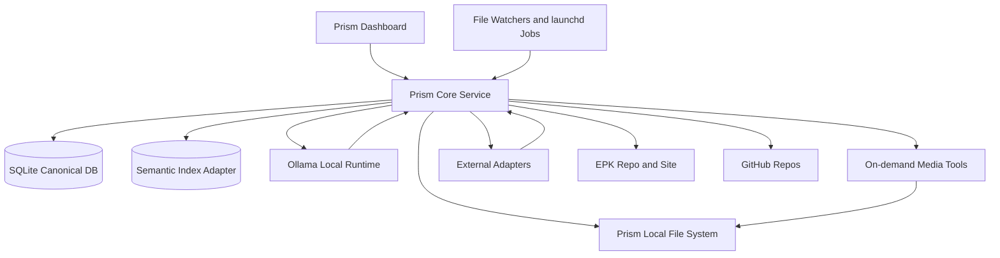

# Local AI Orchestration Hub for Dave Knowles

## Executive recommendation

The best fit for Dave Knowles on an Apple Silicon M1 Mac with 16GB RAM is **not** a single giant self-hosted platform. It is a **small, layered Personal OS cluster** built around four principles: **local-first defaults, SQLite as the canonical control plane, file-system-native media storage, and human approval before any external write action**. That keeps the system useful on constrained hardware today, while preserving a clean upgrade path to a Mac Studio, Linux box, or cloud GPU later. This recommendation is consistent with the strongest current local runtimes and self-hosted tools: Ollama is the easiest supported local runtime with an official Docker image and current macOS support; Ollama’s Apple Silicon path now also has an MLX-powered preview, which strengthens its future on Macs; llama.cpp remains the low-level escape hatch with Metal builds and an OpenAI-compatible server; MLX-LM is the Apple-native advanced option when Dave wants tighter Apple Silicon optimisation or local fine-tuning. citeturn39search0turn39search1turn39search3turn39search4turn39search2turn12search3turn39search7turn39search11

The recommended cluster is:

**Always-on core**
- **Prism Core Service** owned by the Prism repos: local API, file watcher, workflow queue, adapters, approvals, audit log, SQLite database, and optional embedding cache.
- **SQLite** as the canonical operating database and metadata store, because it is embedded, serverless, zero-configuration, and extremely reliable for a solo local app. Use **DuckDB** only for analytical rollups and monthly dashboards, not as the transaction store. citeturn33search1turn33search3turn33search0turn33search2
- **Ollama** as the default local model server, with **Qwen3 4B** for the main assistant, **Qwen2.5-Coder 7B** for code-sensitive tasks, **Qwen3 1.7B** for fast summarisation, and **BGE-M3** or **nomic-embed-text** for embeddings depending on memory tolerance. The 4B–8B model class fits this machine far more realistically than 14B+ models. citeturn30search3turn28search1turn29search9turn29search0turn29search4turn29search10
- **launchd + macOS File System Events** for local scheduling and file-triggered jobs, because they are native to macOS and lighter than forcing everything through a visual automation server. citeturn38search0turn38search1

**On-demand media tools**
- **whisper.cpp** for local transcription/captioning.
- **Essentia + librosa + aubio** for BPM, key, loudness, section hints, and general MIR features.
- **Basic Pitch** for lightweight audio-to-MIDI.
- **Demucs** only as an overnight or explicit job for stem separation.
- **ffmpeg + PySceneDetect** for video preparation, proxies, cuts, crops, thumbnails, and short-form packaging.
- **ComfyUI** only for occasional generative image work, and only as an on-demand service. citeturn21search0turn20search1turn20search2turn20search3turn22search1turn22search6turn19search0

**External services**
- **Google Calendar**, **Gmail**, **GitHub**, and **Buffer** remain external systems, but they should be reached only through Prism adapters and only through explicit approval states for any write action. Buffer is the strongest publishing choice here because it currently supports Instagram, TikTok, LinkedIn, Threads, Bluesky, YouTube Shorts, Pinterest, Google Business, Mastodon, Facebook, and X, and Buffer now exposes an official API/builder path suitable for scripting and n8n integration. citeturn17search9turn17search15turn18search6

**Coding tools**
- **Aider** as the default coding agent in the terminal, because it is git-native, Apache-licensed, and works cleanly with local or cloud models.
- **GitHub Copilot** as an optional cloud complement for IDE and issue-driven work.
- **Cline** as an optional IDE agent if Dave wants an MCP-aware editor-native agent.
- **Codex**, where available, should be used against a strong repository safety contract and explicit branch/test rules.
- **OpenHands** is worth revisiting later, but not on day one for a single-user M1 laptop. Continue is in organisational transition after acquisition by Cursor, and Roo Code has been shut down, so neither should be the primary long-term foundation for this build. citeturn26search0turn26search2turn25search4turn25search1turn25search12turn26search19turn27search0turn24search2turn26search1turn26search4

**Deferred or optional later**
- **Open WebUI** as a temporary general-purpose cockpit only if Dave wants a ready-made chat front end. It is powerful, but its function/plugins model can execute arbitrary Python on the server, and its licensing has changed from the earlier BSD-3 era to the current Open WebUI licence with branding conditions. That makes it useful, but not something Prism should depend on as a core control plane. **LibreChat** is the cleaner MIT-licensed alternative if licensing simplicity matters more than Open WebUI’s ecosystem. **AnythingLLM** is also actively maintained and MIT-licensed, but it overlaps too much with the workflow/memory layer Prism should own directly. citeturn10search10turn10search13turn31search0turn31search5turn31search10turn31search2turn31search7turn10search14turn10search17turn31search1turn31search11

The architectural decision that matters most is this: **Prism should own orchestration, state, approvals, schemas, and local workflow contracts; third-party apps should remain replaceable dependencies behind adapters**. That avoids building a fragile science project and keeps Dave’s Personal OS coherent as hardware and tools evolve. The Model Context Protocol is useful as a standard for tool exposure, but Prism should still expose a stable internal CLI/REST layer of its own, rather than relying on chat UI plugins as the primary system boundary. citeturn12search2turn12search10turn12search14

## Recommended cluster and fit matrices

The table below focuses on **recommended-now** tools. The fit judgements combine official platform support with practical architectural inference for a solo M1/16GB setup.

| Tool | Role | Always-on | M1 16GB fit | RAM/CPU notes | Docker | Apple Silicon notes | Risk |
|---|---|---:|---|---|---|---|---|
| Prism Core Service | Owned orchestration layer, adapters, queue, approvals, audit | Yes | **Strong** | Keep it lean: Node/Python worker + SQLite only; no heavyweight broker needed initially | Optional | Native app/service is preferable on macOS | Low |
| SQLite | Canonical operating DB | Yes | **Strong** | Embedded, serverless, single-file DB; ideal for local transactional control plane citeturn33search1turn33search3 | N/A | Excellent local fit | Low |
| DuckDB | Analytics/rollups | On demand | **Strong** | In-process OLAP; use for dashboards and rollups, not canonical writes citeturn33search0turn33search2 | N/A | Strong local analytics fit | Low |
| Ollama | Default local runtime | Yes | **Strong** | Feasible with 4B–8B models; model residency dominates RAM use. Official Docker image; macOS 14+ support; MLX-powered preview on Apple Silicon citeturn39search1turn39search3turn39search4turn39search10 | Yes | Explicit macOS support | Low |
| Qwen3 4B | General local assistant | Loaded on demand | **Strong** | 2.5GB model size in Ollama listing; good default for local assistant and tool use citeturn30search3 | Via Ollama | Good first local model on M1 | Low |
| Qwen3 8B | Better reasoning fallback | Loaded on demand | **Good** | 5.2GB model size in Ollama listing; use when deeper reasoning is worth latency/memory citeturn30search3 | Via Ollama | Still viable on 16GB if nothing else heavy is open | Medium |
| Qwen2.5-Coder 7B | Local code model | Loaded on demand | **Good** | 4.7GB in Ollama listing; purpose-built code-specialised model family citeturn28search1turn28search9 | Via Ollama | Suitable local coding fallback | Medium |
| Qwen3 1.7B | Fast summariser/classifier | Loaded on demand | **Strong** | 1.4GB in Ollama listing; good for quick triage, summarisation, enqueue decisions citeturn30search3 | Via Ollama | Very easy fit | Low |
| BGE-M3 or nomic-embed-text | Embeddings | On demand or batched | **Strong** | BGE-M3 is 1.2GB and multilingual; nomic-embed-text is ~274MB and lighter, with large-context encoder positioning citeturn29search1turn29search9turn29search0turn29search4turn29search13 | Via Ollama | Good local embedding options | Low |
| whisper.cpp | Transcription/captions | On demand | **Strong** | Optimised C/C++; Apple Silicon support via Core ML/Metal paths citeturn21search0turn21search11 | Not needed | Excellent Mac fit | Low |
| Essentia | MIR/audio analysis | On demand | **Good** | Broad MIR library; CPU-bound but practical for batch track analysis citeturn20search1turn20search9 | Optional | Build/install effort is the main cost | Medium |
| Basic Pitch | Audio-to-MIDI | On demand | **Good** | Lightweight AMT tool; best on single-instrument material citeturn20search2turn20search10 | Optional | Good occasional utility | Low |
| Demucs | Stem separation | On demand, overnight | **Marginal but usable** | Heavy compared with the rest; use as explicit, queued work only citeturn20search3turn20search24 | Optional | Best treated as offline batch work | Medium |
| ffmpeg | Media transforms | On demand | **Strong** | Command-line Swiss army knife for media packaging citeturn22search1turn22search5 | Optional | Excellent fit | Low |
| PySceneDetect | Scene/shot detection | On demand | **Strong** | Lightweight helper for cut detection and reel prep citeturn22search6turn22search2 | Optional | No notable Mac risk | Low |
| DaVinci Resolve | Manual video editor | On demand | **Usable with care** | Powerful all-in-one editor; on 16GB M1, treat heavy Fusion/AI work as constrained and keep Resolve manual, not automated infrastructure. Support for modern macOS is official; the “tight on 16GB” judgement is a practical inference from workload scope citeturn22search0turn23search6 | No | Good app target, not a background service | Medium |
| Buffer | Social publishing | External | **Strong** | External SaaS; local hub should only draft/queue/approve | N/A | Broad current channel support + API path citeturn17search9turn17search15turn18search6 | Low |
| n8n | External workflow bus | Optional always-on | **Good** | Useful for SaaS automations; avoid making it the local event core. 400+ integrations and self-host options exist citeturn13search0turn13search3 | Yes | Fine if limited to external workflows | Medium |
| Open WebUI | Temporary cockpit | Optional | **Good** | Useful operator UI, but functions can execute arbitrary Python and licensing has changed; do not make it the privileged brain of the system citeturn10search10turn10search13turn31search0turn31search5 | Yes | Works, but keep trust boundary tight | Medium |
| Aider | Main coding agent | On demand | **Strong** | Terminal-first, git-native, model-agnostic; best first coding assistant for Prism repos citeturn26search0turn26search2 | Optional | Excellent Mac fit | Low |

The capability matrix below maps the tool stack to Dave’s actual goals.

| Goal | Primary tool | Supporting tools | Local or cloud | Human approval | Notes |
|---|---|---|---|---|---|
| File management | Prism Core + macOS folders | Spotlight/FSEvents, TagSpaces optional | Local | For deletes/moves | TagSpaces is useful as a file-based organiser with tags that travel with files, but it should not become the canonical metadata authority. citeturn15search0turn15search7turn38search1 |
| Poster design | Template engine in Prism | SVG/HTML/CSS, Pillow/ImageMagick, ComfyUI optional, Canva/Adobe Express optional | Primarily local, optional cloud finishing | Yes | Prefer deterministic templates first; use generative tools only for backgrounds/concepts. ComfyUI supports Apple Silicon installs. citeturn19search0turn19search16 |
| Social media design | Template engine in Prism | ffmpeg, Pillow, EPK bridge | Local | Yes | Generate all crops/variants locally; final visual polish optional in cloud tools |
| Social scheduling | Buffer | Prism approvals, n8n optional | External publish, local drafting | **Required** | Buffer currently covers the relevant modern channels and has an official automation/API path. citeturn17search9turn17search15turn18search6 |
| Bookings | Prism SQLite CRM | Gmail, Contacts, Calendar, optional public booking form | Mixed | **Required** | Keep the canonical CRM local; external schedulers are optional intake layers, not the system of record |
| Calendar | Google Calendar through adapter | Prism approval objects | External sync, local draft | **Required** | Never write directly from an LLM without explicit approval |
| Audio analysis | whisper.cpp + Essentia | librosa, aubio, Basic Pitch, Demucs optional | Local | For publishing outputs | Good local pipeline for transcription + MIR + tagging citeturn21search0turn20search1turn20search2turn20search3 |
| Video workflow | DaVinci Resolve manual | ffmpeg, PySceneDetect, whisper.cpp | Mixed, mostly local | For exports/uploads | Keep creative edit manual; automate prep and packaging only citeturn22search0turn22search1turn22search6 |
| Coding | Aider | Copilot optional, Codex optional, Cline optional | Mixed | For git writes/merges | Aider first; heavier autonomous agents later citeturn26search0turn25search4turn26search19 |
| Knowledge and memory | SQLite + semantic index | DuckDB rollups, Obsidian optional | Local | N/A | Obsidian remains useful as a human-facing Markdown vault, not the system control plane. citeturn32search0turn32search2 |
| EPK updates | EPK repo | Spectra bridge, Prism adapters | Git-backed local + public deploy | **Required** | EPK already exposes a machine-readable bridge and keeps `public/data/epk.json` as source of truth. citeturn7view0turn37view1 |
| Admin automation | Prism queue + launchd | n8n for SaaS, SQLite logs | Mostly local | **Required** on external actions | Use native macOS scheduling/file events locally, n8n only where SaaS glue is needed. citeturn38search0turn38search1turn13search3 |

## System topology and data ownership

The recommended topology is intentionally small. Prism is the **operator and policy layer**; local files are the **content layer**; SQLite is the **control layer**; and external tools are behind **adapters with approval states**.



This topology aligns with the current repo direction already visible in Prism’s code. `prism-spectra` is explicitly a local-first orchestration engine and CLI, exporting routing, memory, safety, checkpointing, execution, and a capability registry; its CLI already frames itself as a “local-first build orchestrator,” probes providers, and records explicit data-boundary semantics for local and remote providers. `prism-focus` is a local-first dashboard with optional AI via Ollama or Claude and graceful degradation when AI is off. `EPK` already exposes a stable browser-side adapter layer for promo-brief generation and keeps `public/data/epk.json` as source of truth. `prism-beam` is already positioned as a coordination/meta repo. citeturn6view0turn35view0turn35view1turn36view0turn41view2turn37view0turn7view0turn37view1turn41view0

The data ownership model should be strict:

| Data domain | Source of truth | Rebuildable | Back up | Version in Git | Do not commit |
|---|---|---:|---:|---:|---:|
| Raw media files | Local folders under `~/Prism/library` | No | Yes | No | Yes |
| Inbox files | Local folders under `~/Prism/inbox` | No | Yes | No | Yes |
| Operational metadata | SQLite | Partly | Yes | Schema only | DB file |
| Vector embeddings | Qdrant/LanceDB adapter | **Yes** | Optional | No | Index blobs |
| Full-text search index | SQLite FTS / Spotlight | **Yes** | Optional | No | Generated index state |
| CRM records | SQLite canonical tables | No | Yes | Schema + fixtures | Real database |
| Content calendar | SQLite | No | Yes | Schema + fixtures | Real database |
| Generated poster/social assets | Local files | Some | Yes | Only templates/examples | Client/private exports |
| Audio analysis outputs | JSON sidecars + SQLite links | **Yes** | Yes | Schema/examples | Large derived batches |
| EPK site content | `EPK/public/data/epk.json` plus versioned published snapshots | Partly | Yes | **Yes** | Private unpublished assets |
| Social post drafts | SQLite + asset refs | No | Yes | Sample fixtures only | Live credentials/analytics |
| Logs and audit trail | SQLite + JSONL log archive | Partly | Yes | Format/docs only | Live logs |
| Secrets | macOS Keychain / `.env.local` outside repo | No | Yes | `.env.example` only | **Yes** |

That structure follows the underlying nature of the tools. SQLite is designed to be an embedded, serverless local database; DuckDB is an in-process analytical engine; Qdrant is a vector database with local/docker and local-mode options; TagSpaces is file-based and purposely avoids database lock-in; and Paperless-ngx is best viewed as a separate documents archive if Dave’s paper/admin volume grows enough to justify it. citeturn33search1turn33search3turn33search0turn15search9turn15search13turn15search0turn15search7turn15search5turn15search20

A practical local folder structure is:

```text
~/Prism/
  inbox/
    audio/
    video/
    images/
    docs/
    bookings/
    social/
  library/
    audio/
      originals/
      masters/
      stems/
      mixes/
      analysis/
    video/
      originals/
      projects/
      clips/
      captions/
      thumbnails/
    images/
      photos/
      brand/
      source-art/
    epk/
      exports/
      snapshots/
    posters/
      source/
      generated/
      approved/
    social/
      drafts/
      approved/
      published/
    contracts/
    invoices/
    admin/
  exports/
    buffer-ready/
    resolve-ready/
    caption-burnins/
    promo-packs/
  system/
    db/
    logs/
    workflows/
    indexes/
    queue/
    approvals/
    config/
    temp/
```

The naming convention should be **date-first, slug-second, revision-last**, for example:

- `2026-07-18_show-venue-city_poster_v01.png`
- `2026-07-18_track-title_mix_v03.wav`
- `2026-07-18_booker-name_lead.json`

Every analysed asset should get a sidecar such as `filename.ext.prism.json` containing:
- `asset_id`
- `sha256`
- `ingest_time`
- `source_path`
- `kind`
- `tags`
- `derived_files`
- `analysis_status`
- `analysis_refs`
- `approval_state`

That keeps raw files human-usable even if Prism is offline, while still giving the system a durable metadata bridge. The file watcher layer should rely on macOS File System Events, and background scheduling should rely on `launchd` rather than cron-like hacks. citeturn38search1turn38search0

## Schemas and workflow catalogue

The initial operating database should stay intentionally small and concrete. One SQLite file is enough for the MVP. A representative schema plan is below.

| Table | Key fields | Relationships | Read/write workflows | Canonical or derived |
|---|---|---|---|---|
| `contacts` | `id`, `name`, `email`, `phone`, `notes`, `source`, `created_at` | linked to promoters, venues, leads, invoices | booking triage, CRM review, show workflow | Canonical |
| `venues` | `id`, `name`, `city`, `capacity`, `contact_id`, `notes` | `contact_id -> contacts` | booking, show planning, content calendar | Canonical |
| `promoters` | `id`, `name`, `agency`, `contact_id`, `priority` | `contact_id -> contacts` | booking triage, follow-up | Canonical |
| `booking_leads` | `id`, `source_email_id`, `contact_id`, `venue_id`, `status`, `proposed_date`, `fee_range`, `notes`, `approval_state` | links contacts/venues/shows | email triage, booking review | Canonical |
| `shows` | `id`, `title`, `venue_id`, `date_start`, `date_end`, `status`, `calendar_event_ref`, `poster_asset_id` | venue/assets/social | poster, scheduling, calendar sync, EPK | Canonical |
| `tasks` | `id`, `title`, `domain`, `status`, `due_at`, `owner_mode`, `linked_record_type`, `linked_record_id` | polymorphic link | dashboard, weekly admin review | Canonical |
| `content_calendar` | `id`, `content_type`, `show_id`, `publish_at`, `platforms`, `status`, `campaign_tag` | show/assets/social posts | content planning, social workflow | Canonical |
| `assets` | `id`, `path`, `kind`, `sha256`, `title`, `tags`, `approval_state`, `sidecar_path` | links to shows, social posts, EPK items | ingest, poster pipeline, archive | Canonical |
| `audio_tracks` | `id`, `asset_id`, `title`, `duration`, `bpm`, `key`, `loudness`, `transcript_ref` | `asset_id -> assets` | audio ingest, setlist planning, captions | Canonical with derived fields |
| `video_projects` | `id`, `asset_id`, `resolve_project_path`, `caption_status`, `shorts_status` | `asset_id -> assets` | video ingest, captions, short-form prep | Canonical |
| `epk_items` | `id`, `kind`, `source_ref`, `status`, `published_version`, `external_url` | links assets/shows | EPK sync and publishing | Canonical locally, mirrored to repo |
| `social_posts` | `id`, `content_calendar_id`, `asset_id`, `caption`, `platform`, `status`, `buffer_ref`, `published_at` | links content/assets | approval, scheduling, analytics import | Canonical |
| `workflow_runs` | `id`, `workflow_name`, `trigger`, `status`, `started_at`, `finished_at`, `log_ref`, `error_summary` | links decisions/assets/leads | all workflows | Derived but important |
| `ai_decisions` | `id`, `workflow_run_id`, `model`, `prompt_hash`, `decision_type`, `output_summary`, `requires_approval` | linked to approvals | all AI-assisted workflows | Derived/audit |
| `human_approvals` | `id`, `subject_type`, `subject_id`, `requested_at`, `approved_at`, `approved_by`, `decision`, `notes` | polymorphic | publishing, email, calendar, git writes | Canonical for governance |

The schema should be exposed through a **typed repository layer**, not directly through UI code. Prism can then swap the surface later: a custom UI now, optional Baserow mirror later. Baserow is open source and MIT-licensed, but it is a larger always-on service and should be treated as an optional admin surface, not as the brain of the system. NocoDB is technically capable, but its current licensing is less straightforward for a long-term local platform, which makes it the weaker default here. citeturn31search3turn16search4turn16search20turn16search1turn31search4

The workflow catalogue should start with a small, high-value set.

| Workflow | Trigger | Inputs | Steps | AI calls | Tools | Human approval | Outputs | Failure handling | Codex implementation note |
|---|---|---|---|---|---|---|---|---|---|
| Audio file ingest | New file in `inbox/audio` | File path, hash | classify → create asset → extract metadata → enqueue analysis → write sidecar | optional title/tags summary | watcher, ffprobe, whisper.cpp, Essentia | No for ingest | asset row, sidecar, queued jobs | mark failed analysis, never delete original | Build first; it teaches the whole ingest architecture |
| Poster generation | Show approved or poster task raised | show metadata, venue, EPK brief | assemble prompt package → render template → optional generate background → save variants | prompt packaging only | template engine, ComfyUI optional | **Yes** | poster assets, crops | keep previous version, log failure | Start template-first, generator second |
| Social post draft | Show or release selected | show/release, assets | gather context → draft captions → generate platform variants | yes | local model, EPK adapter | **Yes** | draft posts | save draft with “needs review” | No auto-publish |
| Social approval and scheduling | Approved draft | draft post, platform refs | map assets → create schedule request → send to Buffer adapter | minimal | Buffer adapter | **Yes** | scheduled post refs | leave in approved-unscheduled state | Keep adapter mockable |
| Booking email triage | New Gmail lead | email subject/body, sender | classify → extract contact/venue/date/fee hints → create lead → suggest reply draft | yes | Gmail adapter, local/remote LLM | **Yes** | lead record, draft reply | confidence threshold routes to manual review | Never send automatically |
| Booking confirmation to calendar | Lead approved | lead + date | draft show → draft calendar event → link contacts/assets | maybe | Calendar adapter | **Yes** | draft event / approved event ref | retain draft object, no silent retries | Calendar writes gated |
| EPK asset update | Approved new credit/show/photo | asset refs or content change | update structured local record → generate patch for EPK repo → commit candidate | yes for summary text | Git adapter, EPK bridge | **Yes** | PR/commit patch | leave staged diff only | Preserve `epk.json` as source of truth |
| Video captioning | New video in inbox | video file | audio extract → transcribe → align subtitles → save SRT/VTT | yes | ffmpeg, whisper.cpp, whisperX optional | Optional | captions | keep raw transcript even if alignment fails | Avoid WhisperX by default on M1 unless needed |
| Short-form clip preparation | Video marked for clips | video + transcript | scene detect → quote candidates → crop specs → thumbnail stills | yes | PySceneDetect, ffmpeg, local model | **Yes** | clip package | keep suggestions as drafts | Manual editorial cut remains in Resolve |
| Repo coding sprint assistant | Daily coding session | repo status + goal | scan repo docs → create plan → run tests → suggest safe task list | yes | Aider/Codex/Cline, git | **Yes** for writes | branch, changelog, task plan | branch rollback, checkpointing | Add repo rules before autonomy |
| Weekly admin review | Scheduled via launchd | DB records + logs | summarise leads, tasks, invoices, social queue | yes | SQLite, DuckDB | Yes for any action | weekly review note | partial report still emitted | Good first dashboard workflow |
| Monthly music career dashboard | Monthly schedule | shows, posts, bookings, assets | aggregate metrics → generate narrative summary | yes | DuckDB, SQLite | No | dashboard snapshots | mark missing sources clearly | Start as report, not full BI app |

The standard interface pattern should be:

- **Internal Prism CLI** for deterministic local workflows.
- **Local REST API** for the dashboard and external shells.
- **Adapter interface** per dependency, all mockable.
- **MCP exposure** only for safe read tools or tightly scoped task servers.
- **Webhooks** only for inbound external events.
- **File watchers** for asset ingest.  

That mirrors the current direction of `prism-spectra`, which already models executors, routing tiers, file locking, checkpoints, validation, and capability registries, and it aligns with MCP’s role as a tool standard rather than a whole application architecture. citeturn35view0turn36view0turn12search2turn12search14

## Deployment, security, performance, risks, and build order

The deployment plan for the M1/16GB target should be phased.

**Minimum viable install**
- Native: Ollama, Prism Core, Aider, ffmpeg, whisper.cpp, optional Obsidian.
- Homebrew/system: `ollama`, `ffmpeg`, `sqlite`, `duckdb`, `python`, `node`, `git`.
- No Docker required for the first milestone.
- Models: `qwen3:4b`, `qwen3:1.7b`, `qwen2.5-coder:7b`, and one embedding model.
- Scheduling: `launchd`.
- File triggers: macOS file event watcher.  
Ollama’s macOS installation is officially supported on modern macOS; it also warns that model storage can take tens to hundreds of GB, so model choice must stay disciplined. citeturn39search10turn39search1

**Recommended install**
- Add Docker Desktop only if Dave wants **n8n**, **Open WebUI**, or packaged **Qdrant**.
- Add Buffer/Google/GitHub adapters with approval states.
- Add EPK repo sync workflow.
- Add ComfyUI and PySceneDetect only after the ingest/search pipelines are stable.  
n8n is strong when external SaaS automations matter, but it should be optional infrastructure, not the centre of the local OS. Open WebUI may help as a stopgap cockpit, but its plugin/function security model means it should never hold unrestricted system privileges by default. citeturn13search3turn10search10turn10search13

**Expanded install for stronger hardware**
- Add bigger 8B–14B models or remote Linux model host.
- Add Qdrant as a long-running vector service if semantic retrieval becomes central.
- Add local image generation/node workflows at higher parallelism.
- Move heavy jobs, like Demucs or bigger vision models, to a Mac Studio, Linux server, or cloud box while keeping Prism as the control plane. citeturn15search13turn15search17turn19search0

The security and privacy model should be explicit:

- **Default local-only**: file ingest, metadata extraction, search, summarisation, poster templating, captioning, and coding orientation should run locally first.
- **Cloud fallback**: only when the task is clearly beyond local model quality or when a human explicitly chooses a remote provider.
- **Secrets management**: macOS Keychain for interactive credentials; `.env.local` outside Git for service tokens; `.env.example` in repos only.
- **Approval gates**: required for social publishing, calendar writes, email sending, file deletion/moves outside the inbox workflow, GitHub pushes/PR creation, and any cloud fallback involving private media or code.
- **Adapter restrictions**: every external adapter should have `dry_run`, `approval_required`, and `allowed_actions` settings.
- **Audit log**: every AI decision and every human approval should be written to an append-only log record plus a normalised SQLite table.
- **Backups**: Time Machine or versioned snapshot backup of `~/Prism`, plus Git for schemas/templates/docs, plus encrypted off-machine copy of the SQLite DB and EPK repo.
- **Social safeguard**: no adapter may publish if the post lacks an approval row and a valid asset reference.
- **Calendar safeguard**: create drafts first; actual write only after approval.
- **Email safeguard**: generate replies, never send automatically.
- **Git safeguard**: branch-only writes by default; protected main branch; test gate before PR.  

These guardrails fit both the risk profile of social/admin workflows and the reality that chat UIs and coding agents can execute high-leverage actions very quickly. Buffer’s publishing power, GitHub Copilot/Cline agentic capabilities, and Open WebUI’s admin-run functions all make human approval a necessary architectural feature, not a nice-to-have. citeturn17search9turn18search6turn25search4turn25search1turn26search19turn10search10

The performance strategy for the M1 machine should be conservative:

- **Always-on**: Prism Core, SQLite, launchd jobs, file watch service, and optionally the Ollama daemon with no large model preloaded.
- **On-demand**: Qdrant/LanceDB indexing, captioning, image generation, scene detection, and any coding agent session.
- **Overnight/batch**: embeddings rebuild, Demucs stem separation, bulk caption regeneration, monthly dashboard refreshes.
- **Remote when available**: large image generation, heavy multimodal models, large coding/reasoning jobs, and any 14B+ inference that competes with active creative software.
- **Queueing**: one media-heavy task at a time; one local model task at a time by default; no parallel image generation on the M1 baseline.
- **Model rules**: keep the default assistant in the 4B class, coder in the 7B class, summariser in the 1–2B class, and embeddings under roughly 1.2GB unless a remote box is available.
- **Avoid memory pressure**: do not run Resolve, ComfyUI, Demucs, and an 8B model at the same time. This is a policy constraint Prism should enforce.  

That approach honours the user’s constraint to reduce overwhelm rather than create a fragile always-on ML lab. It also fits what the current tool ecosystem itself suggests: LM Studio officially recommends 16GB+ on supported Apple Silicon Macs; OpenHands and larger autonomous tools assume more generous working room; and local model tooling is strongest when used as a selective accelerator, not as a full-time swarm. citeturn10search4turn27search0

The main tradeoffs are straightforward. **Ollama** wins on simplicity and ecosystem momentum, but **MLX-LM** is the better experimental option for Apple-native optimisation. **Open WebUI** is a good temporary cockpit, but not a stable architectural centre. **n8n** is excellent for external automations, but native macOS scheduling and Prism-owned queues are lighter and safer for the local core. **Buffer** is the best current publishing hub, but Prism must retain the draft and approval record locally. **ComfyUI** is the best current local image pipeline, but template-first design is vastly more reliable for a working musician brand system. **Aider** is the best first coding agent, while heavier autonomous engineering agents should be deferred until repo contracts, tests, and boundaries are in place. citeturn39search0turn39search4turn10search10turn13search3turn17search9turn19search0turn26search0

The MVP build order should therefore be:

1. Prism architecture docs and repo safety rules.
2. Local dev environment and adapter contracts.
3. File ingest pipeline.
4. SQLite metadata and search foundation.
5. Booking/content/show schemas and approval model.
6. EPK bridge integration.
7. Social draft pipeline.
8. Audio ingest and analysis scaffold.
9. Dashboard.
10. External publishing/calendar/email adapters.
11. Optional media generation tools.
12. Optional vector service and richer cockpit.

**Open questions and limitations**: the public repo inspection was partial because some repositories expose only limited raw/readable content in the current environment; I could inspect enough to identify direction and boundaries, but not every implementation detail. I therefore treat some repo-role recommendations as high-confidence architectural inference guided by visible source files and docs, not exhaustive codebase review. The EPK repo was inspectable enough to support a stronger recommendation than the others. citeturn41view0turn41view2turn35view0turn35view1turn7view0

## Prism repo integration plan and Codex implementation pack

The current repos already suggest a clean product split.

| Repo | Current structure and stack | Existing features | Missing pieces | Recommended role | Boundaries | What to change first | What not to change yet |
|---|---|---|---|---|---|---|---|
| `prism-focus` | Vanilla HTML/CSS/JS, no build step, localStorage, many widget/action/render files, 331 workflow tests, optional Ollama/Claude AI, local AI install helper for Ollama + `llama3.2` citeturn41view2turn34view0turn37view0 | Focus board, tasks, planner, wizard, journal/dump, check-in, music tools, optional AI, graceful degradation citeturn41view2turn37view0 | No canonical DB, no ingest/search layer, no booking/social/media orchestration | **Human-facing dashboard shell** for Today/Inbox/Approvals/Queues | UI only; should consume Prism Core APIs, not own orchestration | Add architecture docs and a thin local API client | Do not rewrite into a heavy front-end framework |
| `prism-spectra` | TypeScript package `ai-forge-core`, Node >=22, exports memory, ledger, routing, task graph, checkpointing, validation, execution engine, capability registry, CLI wizard, local/remote data-boundary model citeturn6view0turn35view0turn35view1turn36view0 | Strong orchestration concepts already exist: provider probing, routing tiers, budget/fallback examples, terminal executor, mock/demo harness citeturn35view1turn35view2turn36view0 | Domain adapters, persistent schema, file ingest, media workflows, service mode, stable HTTP API | **Core orchestration and adapter repo** | Own orchestration, safety, adapters, queueing, storage access layer | Turn the engine into a stable local service with typed adapters | Do not over-expand into a monolith UI |
| `prism-beam` | Workspace meta repo with smoke-test/helper scripts and coordination docs; currently still references sibling repos named `ADHDashboard-git` and `AI-Forge` in smoke script, which indicates legacy naming still exists in tooling citeturn41view0turn34view1 | Workspace-level scripts and templates | Current Prism naming/docs, local stack bootstrap, shared check scripts | **Workspace coordination repo** | No runtime logic | Update layout/docs/scripts to current repo names and local stack | Do not turn it into another product repo |
| `EPK` | Static Cloudflare Pages structure inside `EPK/`, `public/` pages, JSON content source, immutable published snapshots, browser adapter bridge (`window.EPKAdapter`) and promo brief builder citeturn7view0turn37view1 | Public EPK, admin editing flow, versioned snapshots, machine-readable bridge for Spectra automation citeturn7view0 | Richer structured schema for gigs/releases/assets, better sync with booking/content systems | **Public brand/content surface** and canonical press-kit payload | Keep static and Git-backed | Expand `epk.json` schema and add Prism sync docs | Do not embed a full application runtime into the site |

The most important integration decision is:

- `prism-spectra` should become the **Prism Core**.
- `prism-focus` should become the **human control surface**.
- `EPK` should remain the **public publishing surface** and structured artist/brand payload.
- `prism-beam` should remain the **workspace/meta/devops repo**.

Below is the Codex-ready implementation pack.

**Phase 0 — Repo Orientation and Safety Pass**

- **Goal**: inspect all Prism repos, map current architecture, identify tests, scripts, data flows, and unsafe assumptions, without modifying code.
- **Repository**: all four repos.
- **Files to inspect first**:  
  `prism-focus/README.md`, `prism-focus/src/ARCHITECTURE.md`, `prism-focus/tools/install_local_ai.sh`, `prism-focus/src/test_workflows.js`;  
  `prism-spectra/package.json`, `prism-spectra/src/index.ts`, `prism-spectra/src/cli.ts`, `prism-spectra/src/types.ts`, `prism-spectra/REFERENCE_ARCHITECTURE_LOCAL_AI.md`;  
  `prism-beam/README.md`, `prism-beam/scripts/run-workspace-smoke.sh`;  
  `EPK/EPK/README.md`, `EPK/EPK/public/data/epk.json`, `EPK/EPK/public/index.html`. citeturn41view2turn37view0turn34view0turn35view0turn35view1turn36view0turn6view2turn41view0turn34view1turn7view0turn37view1
- **Files likely to modify**: none.
- **Constraints**: read-only; do not rename repos; do not introduce frameworks; preserve existing tests and public site behaviour.
- **Tests/validation commands**: collect, do not run destructive changes; document current commands such as `node src/test_workflows.js` in `prism-focus` and `npm test` in `prism-spectra`. citeturn41view2turn6view0
- **Expected output**: `docs/REPO_ORIENTATION.md` in each repo or a workspace report in `prism-beam`.
- **Do-not-do list**: no code changes, no secret handling, no dependency upgrades.
- **Completion criteria**: a written inventory of architecture, scripts, tests, and boundary recommendations.

**Phase 1 — Architecture Documentation**

- **Goal**: add architecture docs describing the Personal OS cluster, local-first principles, data ownership, app boundaries, and workflow catalogue.
- **Repository**: `prism-spectra` primary, with summary docs in the other repos.
- **Files to inspect first**: current architecture docs and repo READMEs.
- **Files likely to modify**:  
  `prism-spectra/README.md`, `prism-spectra/docs/ARCHITECTURE_PERSONAL_OS.md` new, `prism-focus/README.md`, `prism-beam/docs/COORDINATION.md` new or updated, `EPK/EPK/README.md`.
- **Constraints**: documentation-only; no breaking behavioural changes.
- **Tests/validation**: markdown lint if present; docs links resolve.
- **Expected output**: topology diagram, data ownership table, workflow catalogue, repo boundaries.
- **Do-not-do**: do not claim unimplemented features as shipped.
- **Completion criteria**: all four repos point to a coherent shared architecture.

**Phase 2 — Local Dev Environment**

- **Goal**: add a safe local development setup for the cluster.
- **Repository**: `prism-beam` for shared tooling, `prism-spectra` for service config.
- **Files to inspect first**: existing scripts and smoke checks.
- **Files likely to modify**: `docker-compose.local.yml`, `.env.example`, `scripts/check-local-stack.sh`, `docs/LOCAL_STACK.md`, update `run-workspace-smoke.sh`.
- **Constraints**: no real secrets; Docker optional; native-first path must remain supported.
- **Tests/validation**: shellcheck where available; `bash scripts/check-local-stack.sh`.
- **Expected output**: documented local stack with SQLite-first dev mode and optional Docker add-ons.
- **Do-not-do**: no Kubernetes, no Redis unless truly required.
- **Completion criteria**: a new contributor can start the local stack safely.

**Phase 3 — Tool Adapter Layer**

- **Goal**: implement a minimal typed adapter pattern.
- **Repository**: `prism-spectra`.
- **Files to inspect first**: `src/types.ts`, provider probe code, execution/routing modules.
- **Files likely to modify**: `src/adapters/*` new, `src/providers/*`, `src/config/*`, `src/index.ts`.
- **Constraints**: adapters must be typed, testable, and mockable; no direct SDK calls from UI.
- **Tests/validation**: unit tests for each adapter interface with fake implementations.
- **Expected output**: adapters for Ollama, LiteLLM optional, local filesystem, SQLite, Buffer placeholder, Google Calendar placeholder, Gmail placeholder, ComfyUI placeholder, whisper.cpp placeholder, Essentia placeholder.
- **Do-not-do**: no hard-coded credentials or endpoints.
- **Completion criteria**: all external dependencies are reachable only through adapter contracts.

**Phase 4 — File Ingest Pipeline**

- **Goal**: implement a local file ingest prototype.
- **Repository**: `prism-spectra`.
- **Files to inspect first**: execution engine, task graph, capability registry.
- **Files likely to modify**: `src/ingest/*`, `src/workflows/audioIngest.ts`, `src/workflows/videoIngest.ts`, `src/workflows/fileIngest.ts`, `src/db/schema.sql`.
- **Constraints**: never delete or move originals unless explicitly configured; write JSON sidecars.
- **Tests/validation**: fixture files, repeated-ingest idempotency tests, sidecar-write tests.
- **Expected output**: watcher/inbox flow that classifies file type, records asset metadata, queues analysis, logs workflow run.
- **Do-not-do**: no automatic cloud upload.
- **Completion criteria**: dropping a file into `inbox/` creates records and queued work safely.

**Phase 5 — Memory and Search Layer**

- **Goal**: implement local metadata and semantic search foundations.
- **Repository**: `prism-spectra`.
- **Files to inspect first**: memory exports and current DB abstractions.
- **Files likely to modify**: `src/search/*`, `src/db/*`, `src/embeddings/*`, `src/cli/rebuild-index.ts`.
- **Constraints**: SQLite is canonical; vector index is rebuildable; support no-vector mode.
- **Tests/validation**: search fixtures, rebuild command, FTS tests, embedding adapter mock tests.
- **Expected output**: SQLite schema, FTS search API, embedding generation abstraction, optional Qdrant/LanceDB adapter, rebuild command.
- **Do-not-do**: do not make vector DB the source of truth.
- **Completion criteria**: text search works without vectors; semantic search plugs in cleanly.

**Phase 6 — Creative Asset Pipeline**

- **Goal**: implement the first poster/social asset pipeline.
- **Repository**: `prism-spectra`, with eventual `prism-focus` UI entry points.
- **Files to inspect first**: EPK bridge docs and `epk.json`; show/content schemas.
- **Files likely to modify**: `src/workflows/posterPipeline.ts`, `src/templates/*`, `src/adapters/comfyui.ts`, `src/renderers/*`.
- **Constraints**: template-first; no auto-publish; store approval state.
- **Tests/validation**: sample show fixtures, deterministic output naming tests.
- **Expected output**: prompt package, poster output folder, social crop specs, approval record.
- **Do-not-do**: do not require a GPU generator for baseline success.
- **Completion criteria**: a show record can generate a poster pack even if ComfyUI is mocked.

**Phase 7 — Booking and Calendar Pipeline**

- **Goal**: implement booking workflow scaffolding.
- **Repository**: `prism-spectra`, later surfaced in `prism-focus`.
- **Files to inspect first**: contact/show/task schema docs.
- **Files likely to modify**: `src/workflows/bookingTriage.ts`, `src/workflows/calendarDraft.ts`, `src/adapters/googleCalendar.ts`, `src/adapters/gmail.ts`.
- **Constraints**: no automatic sending or calendar writes; approvals are mandatory.
- **Tests/validation**: parser fixtures from example emails; event-draft generation tests.
- **Expected output**: booking lead records, calendar draft objects, reply draft placeholders.
- **Do-not-do**: do not send email, accept bookings, or create live events automatically.
- **Completion criteria**: a lead becomes a draft workflow with required approvals.

**Phase 8 — Audio Analysis Pipeline**

- **Goal**: implement audio ingest analysis scaffolding.
- **Repository**: `prism-spectra`.
- **Files to inspect first**: asset/audio schema and ingest code.
- **Files likely to modify**: `src/workflows/audioAnalysis.ts`, `src/adapters/whispercpp.ts`, `src/adapters/essentia.ts`, `src/adapters/basicPitch.ts`.
- **Constraints**: support mock mode; store results in structured tables and sidecars.
- **Tests/validation**: fixture metadata tests; mock transcription/MIR tests.
- **Expected output**: transcript records, BPM/key/loudness/section fields, linkage to asset/audio tables.
- **Do-not-do**: do not block ingest on full analysis success.
- **Completion criteria**: an audio file can complete partial analysis and persist structured results.

**Phase 9 — Social Scheduling Pipeline**

- **Goal**: implement social post drafting and scheduling scaffolding.
- **Repository**: `prism-spectra`, then `prism-focus`.
- **Files to inspect first**: content calendar schema, Buffer adapter docs, EPK bridge.
- **Files likely to modify**: `src/workflows/socialDraft.ts`, `src/workflows/socialSchedule.ts`, `src/adapters/buffer.ts`, `src/db/*`.
- **Constraints**: no automatic publishing; approvals required.
- **Tests/validation**: mock Buffer adapter tests; status transition tests.
- **Expected output**: content calendar rows, caption drafts, asset attachments, approval states, scheduling payloads.
- **Do-not-do**: no live posting in tests.
- **Completion criteria**: a post can move from “draft” to “approved” to “scheduled” without publishing automatically.

**Phase 10 — Coding Sprint Assistant**

- **Goal**: implement prompts/templates/scripts that make coding sessions safer.
- **Repository**: `prism-beam` and `prism-spectra`.
- **Files to inspect first**: smoke scripts, docs, tests.
- **Files likely to modify**: `docs/AI_CONTRIBUTION_GUIDELINES.md`, `docs/HANDOVER_TEMPLATE.md`, `scripts/validate-workspace.sh`, `docs/BRANCHING_RULES.md`, `docs/CHANGELOG_TEMPLATE.md`.
- **Constraints**: enforce branch-first workflow and test gates.
- **Tests/validation**: run validation scripts across repos.
- **Expected output**: repo orientation prompt, handover template, validation checklist, contribution rules.
- **Do-not-do**: do not grant agents direct merge authority.
- **Completion criteria**: every future AI coding session has a standard safety contract.

**Phase 11 — Dashboard and Personal OS UI**

- **Goal**: implement the first dashboard view.
- **Repository**: `prism-focus`.
- **Files to inspect first**: widget registry, current render/action structure.
- **Files likely to modify**: new widgets under `src/`, `render*.js`, `actions*.js`, `state.js`, `storage.js`.
- **Constraints**: preserve no-build-step approach; consume Prism Core APIs through a thin client.
- **Tests/validation**: extend current workflow tests.
- **Expected output**: Inbox, Today, Booking Leads, Content Queue, Audio Queue, Social Drafts, System Health, Approval Queue.
- **Do-not-do**: do not move orchestration logic into the front end.
- **Completion criteria**: the dashboard becomes the humane operator surface for Prism Core.

**Phase 12 — Stabilisation and Tests**

- **Goal**: add unit tests, integration tests with mocks, smoke scripts, health checks, docs, and example data.
- **Repository**: all repos, led by `prism-spectra` and `prism-beam`.
- **Files to inspect first**: existing tests/harnesses.
- **Files likely to modify**: `test/*`, `scripts/smoke/*`, `docs/FAILURE_HANDLING.md`, `examples/*`.
- **Constraints**: mocks for external services; repeatable local CI.
- **Tests/validation**: smoke-test script across all repos; fixtures for ingest/search/approval workflows.
- **Expected output**: healthy mock integration suite and documented failure modes.
- **Do-not-do**: no flaky network tests in default CI.
- **Completion criteria**: the local stack can be validated end-to-end without live third-party credentials.

The highest-confidence first build target is therefore:

**Make `prism-spectra` the typed local orchestration core, connect it to a SQLite-first ingest/search/approval model, surface it in `prism-focus`, and treat `EPK` as a static structured publication target.** That is the shortest path to a Personal OS that reduces overwhelm instead of adding more moving parts. citeturn35view0turn41view2turn7view0
